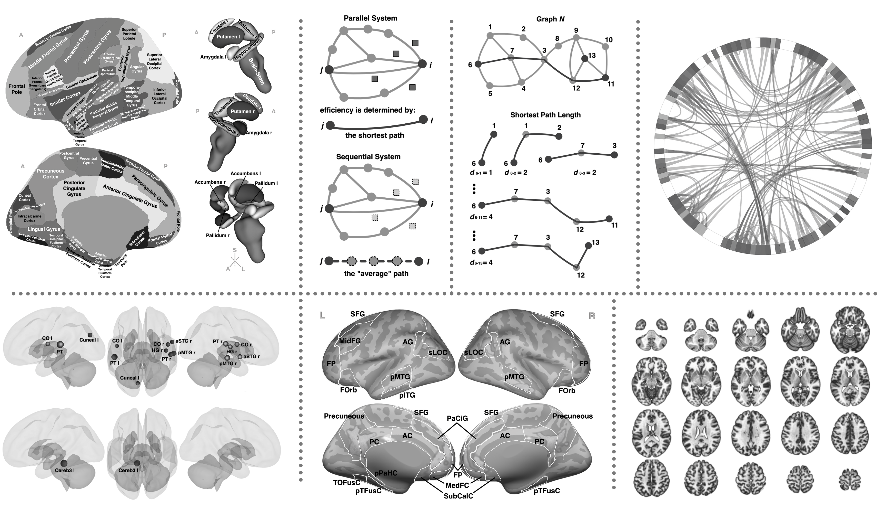
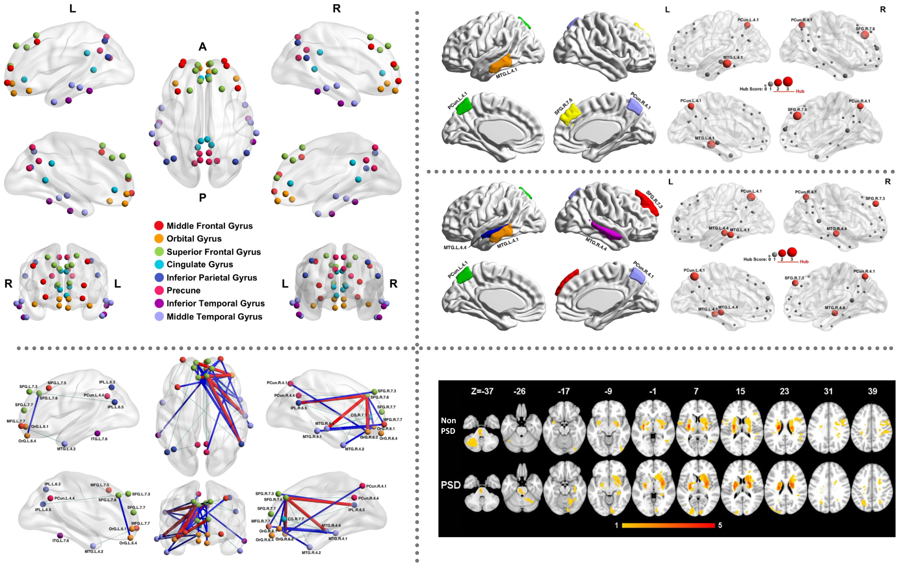

# Research Projects

## (ongoing) Automatic Grading System for Osteoarthritis: an MRI+AI Study

**Updates**

* **[Oct 27 2020]** a prototype for automatic cartilage thickness quantification is under beta test, using both public MRI data from OAI and non-public data collected in Prince of Wales Hospital, N.T., Hong Kong

## (2019-2020) Altered Topological Properties and Functional Connectivity Correlated with Alzheimer’s Disease

*(This work was done during my MPhil program, and also the main part of my MPhil thesis.)*

**Paper**

Drafting a journel paper...

**My Contributions**
* Conceptualization
* Data acquisition
* Data analysis
* Data visualization
* Interpretation of results
* Paper writting & proofreading

**Objectives**
Functional Magnetic Resonance Imaging has been widely used to investigate the activity of human brain. The relationships between abnormal functional properties and neurodegenerative disease have been reported. In this study, the differences of functional brain network between normal controls and subjects with Alzheimer’s Disease (AD) are investigated.

**Results**
To be added after paper publication.

**A Glance at the forthcoming paper**

## (2018-2019) Default Mode Network Reconfiguration in Patients with Poststroke Depressive Symptoms

*(This work was done as part of my MPhil program, a collaborative clinical research project. Many thanks to Dr. Yan LIANG for her great effort.)*

**Paper**
[Liang, Y., **Yao, Y. C.**, Zhao, L., Shi, L., Chen, Y. K., Mok, V. C., ... & Tang, W. K. (2020). Topological reorganization of the default mode network in patients with poststroke depressive symptoms: A resting-state fMRI study. *Journal of Affective Disorders*, *260*, 557-568.](https://www.sciencedirect.com/science/article/pii/S0165032719302915)

**My Contributions**
* Data analysis
* Data visualization
* Interpretation of results from a mathematical perspective
* Drafting the paper (technical part)
* Paper proofreading

**Objectives**
This study mapped the topological configuration of the default mode network (DMN) in patients with depressive symptoms after acute ischemic stroke.

**Methods** 
* Subjects: 36 with poststroke depressive symptoms (PSD) and 37 without PSD. 
* Resting-state functional magnetic resonance imaging (fMRI) was used to examine **functional connectivity (FC)** to reconstruct the DMN. 
* **Network based statistics** estimated the FC differences of the DMN between the PSD and non-PSD groups. 
* **Graph theoretical approaches** were used to characterize the topological properties of this network.

**Results** 
* A widespread hyper-connected configuration of the functional DMN was characterized in PSD group. The orbital frontal, dorsolateral prefrontal, dorsal medial prefrontal, and ventromedial prefrontal cortices, the middle temporal gyrus, and the inferior parietal lobule were the **functional hubs** related to PSD. 
* The **nodal topology** in inferior parietal lobule and superior frontal gyrus, overlapping with dorsal medial prefrontal and ventromedial prefrontal cortices, tended to be functionally integrated in patients with PSD. 

**Conclusions** 
The DMN in PSD was functionally integrated and more specialized in some core hubs such as the inferior parietal lobule and dorsal prefrontal cortex.

**Gallery**	

# Network Implementation

* **Octave Convolution**
  * Paper: [Drop an Octave: Reducing Spatial Redundancy in Convolutional Neural Networks With Octave Convolution](https://ieeexplore.ieee.org/document/9010309)
  * Official website: [facebookresearch/OctConv](https://github.com/facebookresearch/OctConv)
  * My implementation in Keras: [VincentYCYao/OctConv-TransOctConv-Keras](https://github.com/VincentYCYao/OctConv-TransOctConv-Keras)
* **MVC-Net**
  * Paper: [Automated comprehensive Adolescent Idiopathic Scoliosis assessment using MVC-Net](https://www.sciencedirect.com/science/article/pii/S1361841518302871)
  * My implementation in PyTorch: [VincentYCYao/MVC-Net-pytorch](https://github.com/VincentYCYao/MVC-Net-pytorch)

